# Praktikum - Cocktail Mixer Glass Washing
***

## i. Overview of Praktikum
This repository contains the codes, architectures and detailed description for the Praktikum of Human Software Mediator Pattern.

> This repository is ONLY for the Cocktail Mixer's Glass Washing part.

There are two main parts for the task of this project.
1. A REST API server (Socket Server referred to from onwards) to turn an MQTT Enabled Power Socket On/Off, to switch on/off the DC Water Pump respectively and also return the Power Usage of a wash cycle (how much energy in kWh the motor used for one glass cleaning)
2. Using the Process Engine to Integrate the above REST API and also control the Robot Movement to wash multiple glasses in a row.

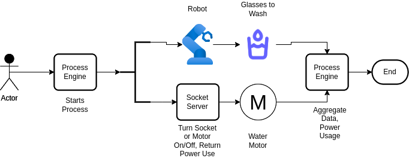

*Picture: Simple Architecture of the Overall workflow of the tasks*

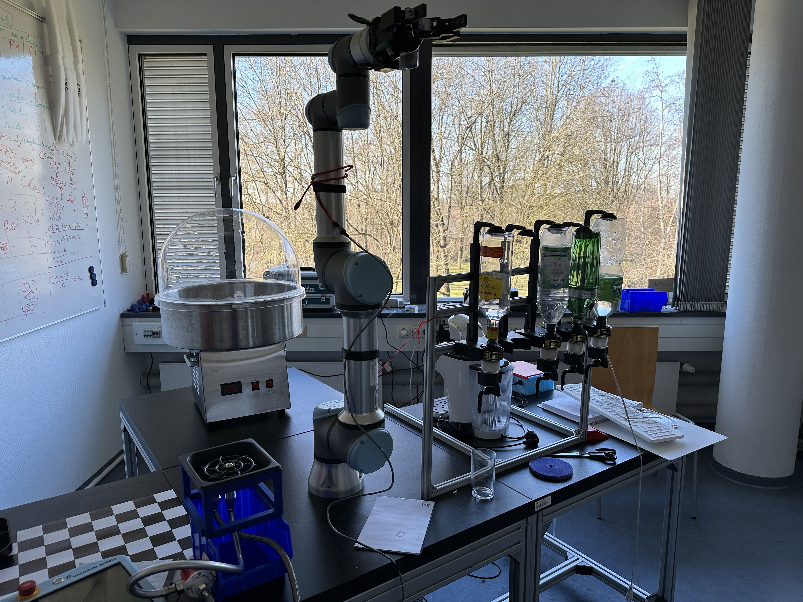

*Picture: Cocktail Mixer Station*

***

## Repository Structure

    .
    ├── cpee
    │   └── washer_register_v2.xml
    ├── img
    │   ├── 5ef5a15fa2fd46.98572189.jpg
    │   ├── 631eff53a09771.36696341.jpg
    │   ├── cocktail_mixer.JPG
    │   ├── cpee_endpoints.png
    │   ├── data_element.png
    │   ├── finished.png
    │   ├── glass_cycle_loop.png
    │   ├── hovering.png
    │   ├── IMG_1774.JPG
    │   ├── MQTT Architecture.drawio.png
    │   ├── overall_architecture_1.png
    │   ├── process_block_1.png
    │   ├── process_block_2.png
    │   ├── process_block_3.png
    │   ├── process_block_4.png
    │   ├── washer_sprayer.JPG
    │   └── whole_process.png
    ├── README.md
    ├── requirements.txt
    ├── robot_files
    │   ├── scripts
    │   │   ├── 10_return_home.script
    │   │   ├── 1_home_to_hover.script
    │   │   ├── 2_hover_to_gls_pick.script
    │   │   ├── 3_pickup_glass_to_hover.script
    │   │   ├── 4_wash_hover.script
    │   │   ├── 6_wash_loop.script
    │   │   ├── 7_wash_complete_to_hover.script
    │   │   └── 8_put_glass_down.script
    │   ├── txts
    │   │   ├── 10_return_home.txt
    │   │   ├── 1_home_to_hover.txt
    │   │   ├── 2_hover_to_gls_pick.txt
    │   │   ├── 3_pickup_glass_to_hover.txt
    │   │   ├── 4_wash_hover.txt
    │   │   ├── 6_wash_loop.txt
    │   │   ├── 7_wash_complete_to_hover.txt
    │   │   └── 8_put_glass_down.txt
    │   └── urp
    │       ├── 10_return_home.urp
    │       ├── 1_home_to_hover.urp
    │       ├── 2_hover_to_gls_pick.urp
    │       ├── 3_pickup_glass_to_hover.urp
    │       ├── 4_wash_hover.urp
    │       ├── 6_wash_loop.urp
    │       ├── 7_wash_complete_to_hover.urp
    │       └── 8_put_glass_down.urp
    ├── src
    │   └── washer_api.py
    └── video
        └── demo.mp4
    

***

## ii. Detailed Architectrue of the two main parts

### 1. Socket Server REST API & MQTT Pub/Sub Architecture for Power Socket and Socket Server

> **TL;DR**: Using the Socket Server REST API endpoints, the Process Engine can later on turn the Delock Power Socket on or off. Socket Server can also return the power usage data in kWh for each time the water pump motor was used from the sensor telemetry data of the power socket to the Process Engine.

This is a REST API server used to control the [Delock WLAN Power Socket Switch MQTT with energy monitoring](http://https://www.delock.com/produkt/11827/merkmale.html "Delock WLAN Power Socket Switch MQTT with energy monitoring"). The WLAN socket supports [MQTT Protocol](https://mqtt.org/ "MQTT Protocol"). The API was implemented using [Bottle: Python Web Framework](https://bottlepy.org/docs/dev/ "Bottle: Python Web Framework"). It serves as an itermediary medium for the power socket, MQTT Broker Server and the Process Engine.

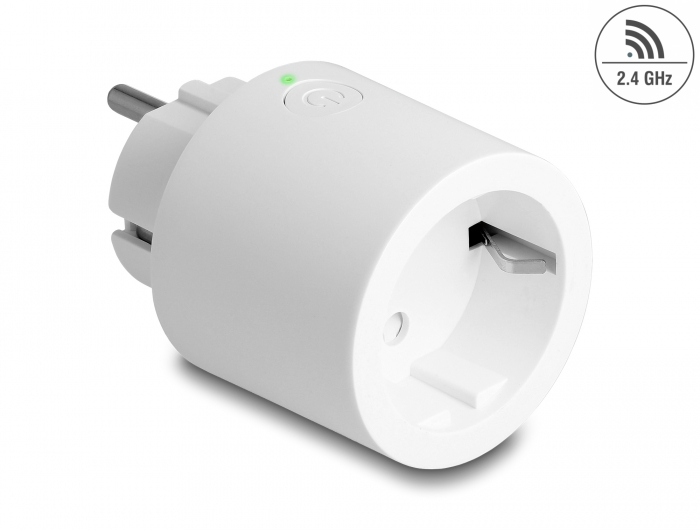

*Picture: Delock WLAN Power Socket with MQTT Support*

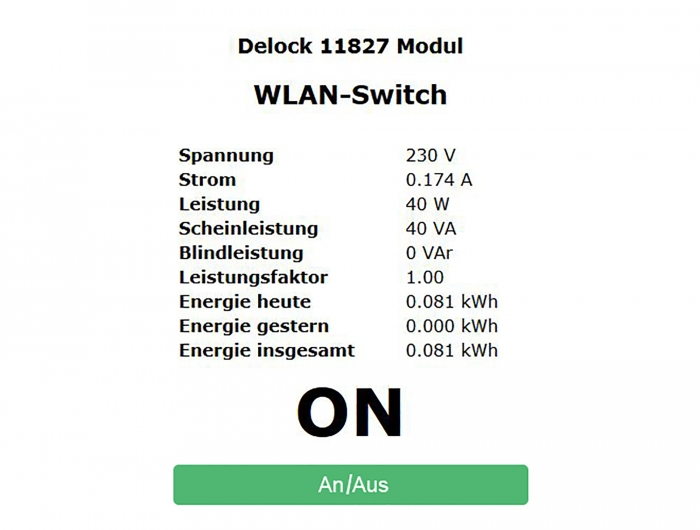

*Picture: Delock Power Socket Web UI*

Using various endpoints of this API and through MQTT protocol, the socket:
1. Can be turned **ON** or **OFF**
2. Can provide current **Power Status** of the switch (on or off)
3. Can provide **Telemetry Data** from socket sensors (voltage, watts, total power usage etc).

#### a. Installation & Running the API Server

- Clone the repository from Github
- Navigate to the cloned Git repo folder
- Create a Virtual Environment using:
`python3 -m venv .venv`
- Activate the Virtual Environment using:
`source .venv/bin/activate`
- Install required dependencies by running the following code:
`python3 -m pip install -r requirements.txt`
- The source code is saved in `/src` directory.
- Run the API server using:
`python3 src/washer_api.py`
- The server will be listening to incoming request from *IPv4* and *IPv6* as well on the custom port *3799*.

#### b. API Endpoints Overview

| Endpoint           | HTTP Method | URL Routing Type | URL Arguments | Usage                                                         | Example Return                                 |
|--------------------|-------------|------------------|---------------|---------------------------------------------------------------|------------------------------------------------|
| /                  | GET         | Static           | None          | To check if the API server is running                         | {"API Working": True}                          |
| /power/{state}     | PUT         | Dynamic          | on            | To turn on the power socket                                   | {'Power On': True}                             |
| /power/{state}     | PUT         | Dynamic          | off           | To turn off the power socket                                  | {'Power Off': True}                            |
| /power/status      | GET         | Static           | None          | To check if the socket is turned on/off                       | {'current_power_status' : ON} |
| /power/consumption | GET         | Static           | None          | Return the power consumption usage each time the motor was on | {"energy consumption for 14s in kWh": 0.00034} |

#### c. API Endpoints Short Explanations

For the **Process Engine**, *endpoints 2 and 4* were called. Rest are for testing purposes.

**1. "/"**
- Base Endpoint.
- To test if the API is running or not
- Refer to code documentations for implementation logics.

**2. "/power/{state}"**
- Uses dynamic routing. {state} part needs to be replaced with "on" or "off".
- MQTT Broker server for topic publishing and subscribing is provided by the lab and it listens on the standard MQTT Port 1883.
- If user calls the endpoint **'/power/on'**, then the function will publish a message to the MQTT broker, causing the switch to *turn on*.
	- The Socket Server publishes to the topic `'cmnd/washer/Power'` to the MQTT Broker Server (using lab's MQTT Broker Server) with the correct payload.
	- The Power socket is subscribed to the same topic and once it receives the published message, it turns itself on.
	- QOS (Quality of Service) is by default 0.
- If user calls the endpoint **'/power/off'**, then the function will publish a message to the MQTT broker, causing the switch to *turn off*.
	- The Socket Server publishes to the topic `'cmnd/washer/Power'` to the MQTT Broker Server with the correct payload.
	- The Power socket is subscibed to the same topic and once it receives the published message, it turns itself off.
	- QOS (Quality of Service) is by default 0.
- If any other value is passed from the URL endpoint, it will return a JSON object notifying the URL endpoint was wrong.
- Refer to code documentations for implementation logics.

**3. "/power/status"**
- This method returns the current status of the power socket to know if it's on or off
- Refer to code documentations for implementation logics in details.

**4. "/power/consumption"**

- Returns the power usage of the motor or appliances from the time it was started (socket switched on) and when it was switched off (socket switched off)
- MQTT socket returns power telemetry data at 10s interval (can NOT go lower than 10s).
- Thus, only an approximation of power usage can be reported.
- Returns energy usage in kWh.
- How energy consumption was calculated:
	- The voltage and current data from the reading and calculated as *watt = voltage * amp*
	- The duration for the motor remained powered on was calculated when the socket was powered off (/power/off endpoint was called)
	- The duration was calculated in seconds.
	- To return power usage in kWh, the duration in seconds was converted to hours.
	- The power in kWh is calculated by multiplying *(watt * duration)* and then dividing by 1000.
- Refer to code documentations for implementation logics in details.

#### d. MQTT Publish/Subscribe Architecture

The WLAN power socket that is being used supports MQTT protocol. This protocol uses the Publish/Subscribe architecture.

We have a server that runs the MQTT Broker Server (provided by praktikum lab) which was used to publish and subscribe to messages. The Socket Server serves as both:
- A **publisher** client (publishes to command topic to turn the socket on or off or get status).
	- Publishes to the topic: `cmnd/washer/Power`
- A **subscriber** client (subscribes to telemtry topic or status topic of the switch to get sensor telemetry data or power status data)
	- Subscribes to the topics:
		 - 1.`stat/washer/RESULT`
		 - 2.`tele/washer/SENSOR`

The Delock Power Socket also serves as a client and subscribes to and publishes to topics. Below architecture diagram shows how publishing and subscribing to topics is done.

*Picture: MQTT Pub/Sub Architecture used in this project*

**Example Scenario:**
When the Socket Server client publishes a Message to the topic `cmnd/washer/Power` with appropriate payload while the Delock power socket had already been subscribed to the same topic and upon receiving the message, it turns the power on or off or publishes the current status of the power socket whether it's on or off to the topic `stat/washer/RESULT`.

The Socket Server client also subcribes to topic for example `stat/washer/RESULT` and receives message when the power socket publishes any message.

***

### 2. Using Process Engine to Control Robot and Delock Power Socket to Wash Glasses

> TL;DR: The Process Engine is used to control the robot movement. It calls robot API endpoints to initiate robot movements, picks up the glasses, washes them and returns to the original positions, calls Server Socket API endpoints to turn the power socket on and off which essentially turns on/off the water pump for the washing mechanism of the cocktail mixer and also retrieves the power usage data.

The Process Engine is used to call different API endpoints to do the whole glass clean up process. There are many glasses that are laid down in a straight line around 100mm apart. 
The process engine starts a process and then calls different robot API endpoints to pick up the first glass from its home position, takes it to the washing tool, turns on the power socket so that the water pump is on, washes the glass 2 times with 2 sec interval in between, then power offs the socket so that the water pump gets turned off, then it returns the first glass to it's original position from where the robot picked it up initially and returns the power usage for that wash cycle. 
Then it continues the loop to pickup and wash the rest of the glasses. After all the glasses are washed completely, the robot then returns back to its home position and the process gets finished.

* The whole Process Engine workflow file is provided in the `cpee` directory. The XML file can be loaded in the Process Engine for execution.

* The robot itself provides a RESTFul API to execute different commands or robot programs remotely.

More details of the whole process is provided below.

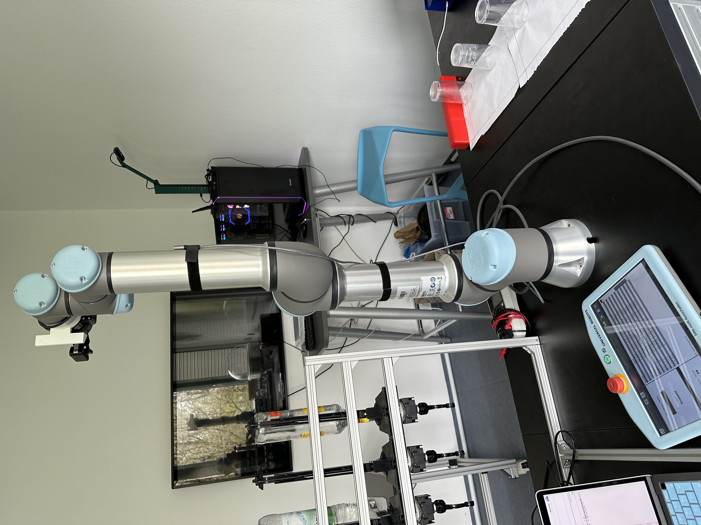

*Picture: Robot Home Position*

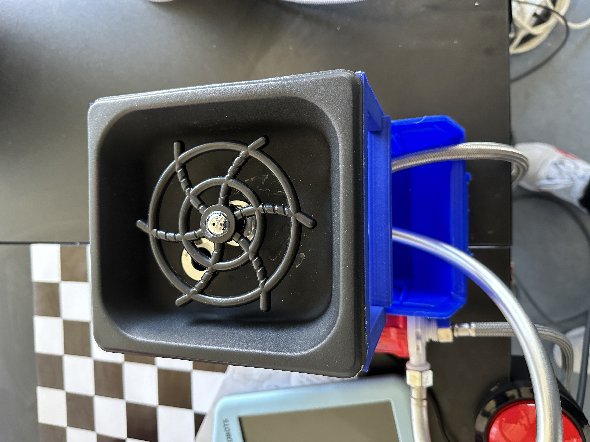

*Picture: Glass Washing Station*

#### a. Process Engine Data Elements

In the process engine, we can put data elements that can be used for various operations.
Here we have 2 data elements.
1. glass_index => 0 : Used to set the position of each glasses. Starts at position 0 for first glass.
2. no_of_glasses => 4 : Used to set how many glasses that needs to be washed.

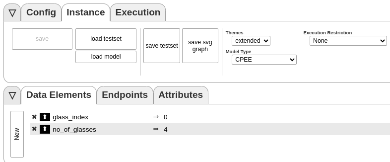

*Picture: Process Engine Data Element*

#### b. Process Engine Endpoints
Below picture provies an overview of all the endpoints that are being called by the Process Engine.

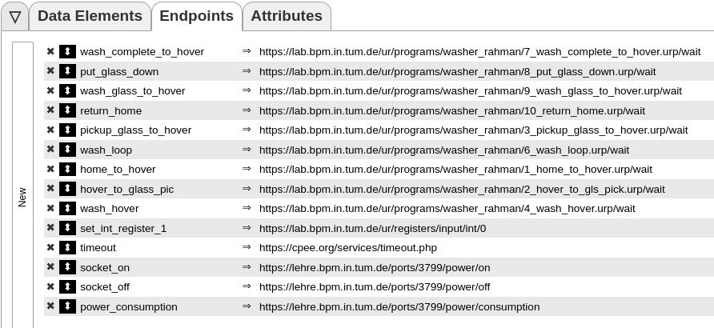

*Picture: Process Engine Endpoints*

#### c. Overview of the Glass Washing Process Architecture
The whole glasses washdown process architecture from the Process Engine is provided in the image. Explanation will be provided in blocks.

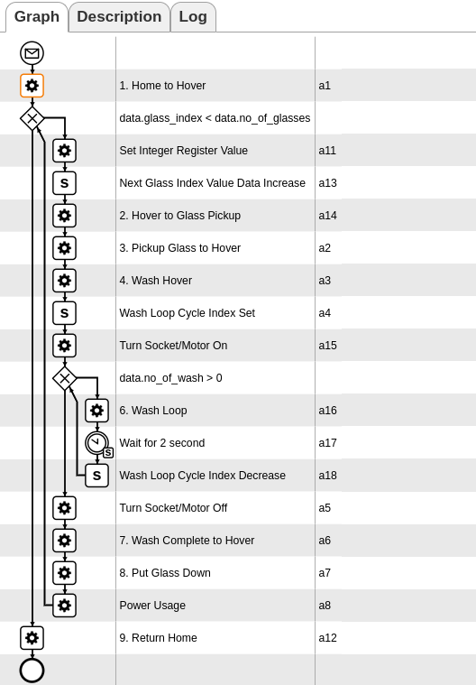

*Picture: Glass Processing Architecture in the Process Engine*

##### 1. Home to Hover

First, the Process Engine starts with the `1. Home to Hover` process, which calls the robot endpoint `home_to_hover`.
This call brings the robot from its *home position* to its *hovering position*.

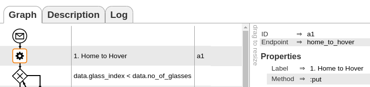

*Picture: Process Home to Hover*

##### 2. Glass Wash Cycle Loop
In this section, the Process Engine runs through a loop to wash each of the glasses as specified in the data element. 
For example, from *hovering position*, the robot picks up the first glass, then washes it and then returns the glass to its position and then returns back to *hovering position* and then continues the washing process for second, third glasses and so on. After the loop ends, the robot returns to its *home position* from *hovering position*.

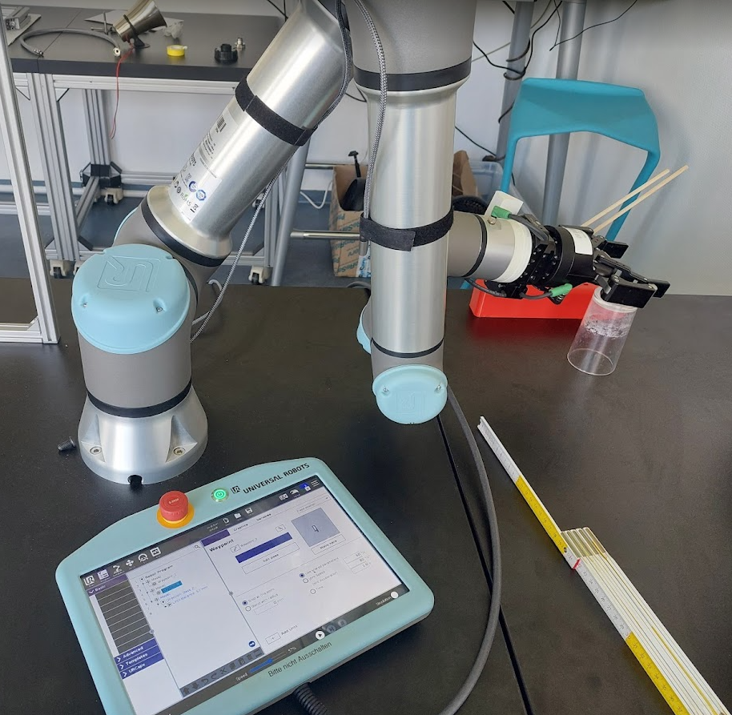

*Picture: Robot Hovering Position*

###### 2.1 Loop and Set Integer Register Value and Increament the Index Value

The Process Engine goes into a loop to pickup glasses one by one and wash them.

- We're checking the condtion `data.glass_index < data.no_of_glasses` for the loop. This means, as long a the glass index is less than the no of glasses to wash, continue the loop and wash all the glasses one after another synchronously.

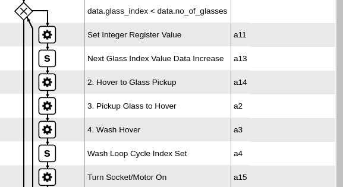

*Picture: Glass Wash Loop until Turning on Socket/Pump*

- Inside the loop, the first service call is *Set Integer Register Value*. 
    - Here, the Process Engine is sending a value to the robot's integer register I/O endpoint, particularly to Integer Register 0 (in1 in the robot) and setting up its value to the current value of `glass_index`. 
    - When it starts, from the data element, `glass_index = 0`.
    - Thus, the Integer Register 1 value is 0 in the robot also. 
    - This helps the robot to calculate the position of the first glass and the subsequent ones.
- Then, the second element, which is a script *Next Glass Index Value Data Increase*.
    - This script does the following: `glass_index += 1`.
    - It increases the index value from the previous one, which is then send to the Integer Register 1 of the robot.
    - Because of this change, the robot will pickup the next glass when the loop returns to top.

###### 2.2 Hover to Glass Pickup
When this service call is executed, based on the value of the `glass_index` and the data that was sent to the Integer Register 1 of the robot, the robot will pickup the corresponding glass using the gripper by closing it appropirately.

If `glass_index = 0`, then Integer Register value will be sent as 0 and the robot will pickup the first glass. On the next loop repeat, `glass index` will be 1 and Integer Register value will be 1. Thus, the robot will pickup the second glass. And this will continue until the loop exits.

###### 2.3 Pickup Glass to Hover
Next service call, *Pickup Glass to Hover* will pick up the respective glass and move up to a hovering position.

###### 2.4 Wash Hover
In this service call, the robot will move from it's last position to glass washer sprayer tool and hover above it.

###### 2.5 Wash Loop Cycle Index Set & Turn Socket/Motor On
- Wash Loop Cycle Index Set:
    - Here in this script, we are setting up a data element `data.no_of_washes` to set the value for how many times the glass will be washed.
    - By default, the value is set to 2. 
    - Thus, every glass will be washed 2 times.
- Turn Socket/Motor On
    - The Process Engine will call the Socket Server API endpoint `power/on`.
    - This will turn on the socket and the DC water pump motor will then turn on.

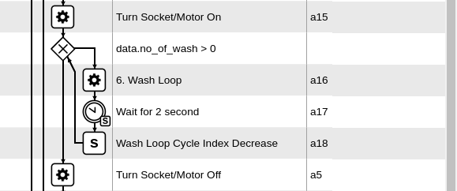

*Picture: Glass Wash Loop from Turn Socket/Motor On to Turn Socket/Motor Off*

###### 2.6 Loop for How many times a single glass will be washed
In this inside loop, we use the value from 2.5 Wash Loop Cycle Index Set to set the condition of how many times a single glass will be washed.
Since the value was set to 2, each glass will be washed 2 times.
- 6 Wash Loop
    - This service call will call the robot API endopoint to press the glass down on the washer sprayer mechanism from its last position.
    - Then the washer mechanism will spray water inside the glass till it remains pressed.
    - It will press down for 5 seconds.
    - Then the robot will move back to it's previous positon above the sprayer mechanism
- Wait for 2 second
    - The robot will then wait for 2 seconds as the CPEE calls the timeout endpoint to wait 2 seconds before executing the next service call.
    - If it's in the next loop, then it will repeat this process again.
- Wash Loop Cycle Index Decrease
    - Here, we're decreasing the value of `data.no_of_washes` data element as `data.no_of_washesh -= 1`so that once it becomes 0, the loop breaks.

###### 2.7 Turn Socket/Motor Off
The Process Engine will then call the `power/off` endpoint of the Socket Server and it will turn the socket off and thus the water motor pump will also turn off.

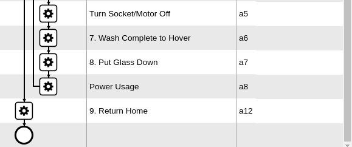

*Picture: Glass Wash Loop till Power Usage and Last Service call 9. Return Home*

###### 2.8 Wash Complete to Hover
From 2.7 Turn Socket/Motor Off, the Process Engine will then execute the service call *7. Wash Complete to Hover*, which will call an endpoint in the robot API and take the robot from its last postion to another hovering position that is towards its home position.

###### 2.9 Put Glass Down
Here, the Process Engine will execute this service call which will call another endpoint in the robot API and the robot will put the glass down from the position where it pickup up. Returns to the glass picking position, drop down, open up the gripper, moves up and then moves back to the hovering position of *1. Home to Hover*.

###### 3.0 Power Usage
In this service call, the Process Engine will call the Socket Server API endpoint `power/consumption` and it will then get the power usage for that partiuclar wash cycle in the kWh metric.

> The loop ends here and depending on the loop condition and the value of `glass_index`, it will either jump to the first position of the loop or exits out to the next service call which is *9. Return Home*

##### 3. Return Home
After all the glasses are finished washing, the loop of section *2. Glass Wash Cycle Loop* will exit and the process engine will execute the last service all *9. Return Home*
It will then return the robot from its hovering position of *1. Home to Hover* to its home position.

##### 4. Finishing of the Process
After successfully executing all the service calls, the Process Engine will stop successfully and will show status "Finished" in the State value for the Execution tab.

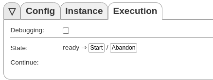

*Picture: Process State Change*

***
## iii. Video Demo

File is also available under the directory 'video'.

**Youtube Link for Demo Video**

Click on the image to redirect to Youtube.

[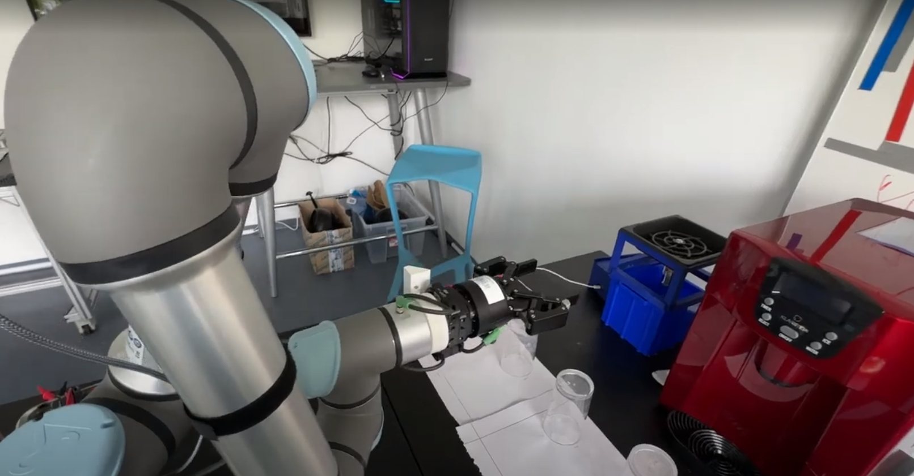](https://www.youtube.com/watch?v=6jo1BjBZV5w)

***

## Acknowledgement
**This practical project was completed by:**

Mishkat Nur Rahman

MS Student

Data Engineering and Analytics

Technical University of Munich

 

**Supervised by:**

Dr. Jürgen Mangler

Chair of Business Informatics and Business Process Management

TUM School of Computation, Information and Technology

Technical University of Munich

 

*Special Thanks to:*

Lisa, Dominik & Johannes for all the technical help and feedback throughout the project :)